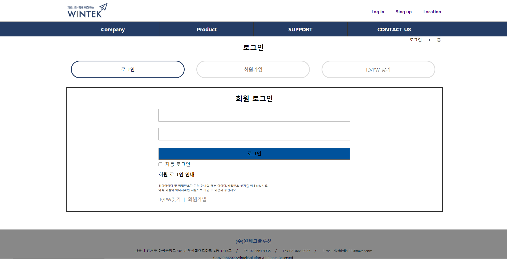
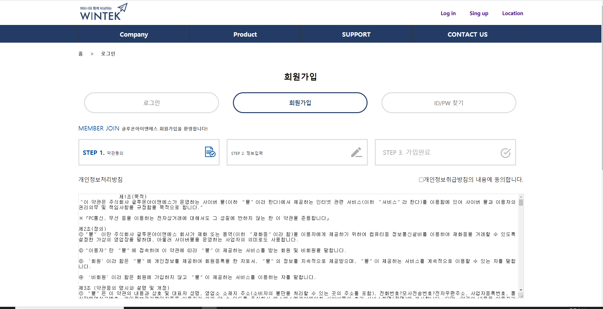

# 1. 메인페이지

  
  

## 설명 

### 메인 페이지 헤더와 banner 부분을 캡쳐하였다. 
### 헤더에는 로고와 로그인,회원가입, Loction이 있으며 banner 부분에는 javascript를 써서 4초가 지나면 다른 이미지가 보이게 구성해났다.

----------------------------------------------------------------------------------------------------------------------------------------------

# 2. 로그인 페이지

  

## 설명  

### 로그인 페이에서는 ID/PW찾기, 자동 로그인 기능, 일반 로그인하는 기능이 있지만 아직 로그인하는 기능만 구현해났다. 

----------------------------------------------------------------------------------------------------------------------------------------------

# 3. 회원가입 페이지

   

## 설명 

### 회원가입 첫 페이지는 이용약관에 대한 설명이 있으며 체크박스를 체크하고 확인 버튼을 누르면 다음 화면으로 이동한다.

----------------------------------------------------------------------------------------------------------------------------------------------

# 4. 회원가입 페이지2

   

## 설명

### 이 화면에서는 사용자에 개인정보를 입력한후 조건이 다 맞은후 확인 버튼을 누르면 회원가입이 완료되는 화면이다.

----------------------------------------------------------------------------------------------------------------------------------------------

# 5. 회원가입 페이지3

   

## 설명 

### 이 화면은 회원가입이 정상적으로 완료가 되었다는 화면이다. 이제 로그이 화면으로 돌아가 아이디 비밀번호를 입력하면 로그인을 할수 있다.

----------------------------------------------------------------------------------------------------------------------------------------------

# 6. 로그인 성공페이지

   

## 설명 

### 로그인이 성공하면 메인 페이지에 있는 Log in이 로그아웃으로 바뀐다. if문에 session값이 있으면 로그아웃으로 바뀌고 없으면 Log in으로 바뀌게 설정하였다.

----------------------------------------------------------------------------------------------------------------------------------------------
# 7. 마이페이지

   

## 설명 

### 마이페이지를 누르면 로그인 한 회원에 개인정보가 나온다. select * from (table_name)을 사용하여 session에 저장된 ID값을 가진 회원에 개인
### 가져온다.

----------------------------------------------------------------------------------------------------------------------------------------------

# 8. 회원수정 페이지

   

## 설명

### 회원 수정 페이지에서는 비밀번호를 입력해서 값이 같으면 회원정보를 수정하는 페이지로 이동한다. 여기서 비밀번호 값은 input에 입력된 값과 
### session에 저장된 값이 같아야 넘어가게 한다.

----------------------------------------------------------------------------------------------------------------------------------------------

# 9. 회원수정 페이지2

   

## 설명

### 이 페이지는 회원정보를 수정할수 있는 페이지다. sql = update from (table_name) where (column_name)=? 사용하여 수정할 값을 수정한후 수정 버튼을 누르면 수정이된다.

----------------------------------------------------------------------------------------------------------------------------------------------

# 10. 회원 탈퇴페이지

   

## 설명

### 이 페이지에서는 회원 탈퇴를 할라면 비밀번호를 입력해야한다. 비밀번호는 위에 회원수정과 같이  input에 입력된 값과 session
### 에 입력된 값이 같아야 한다. 값이 같으면 회원정보 확인이라는 alert문이 뜬다.

----------------------------------------------------------------------------------------------------------------------------------------------

# 11. 회원 탈퇴페이지2

   

## 설명

### 이 페이지에서는 회원이 삭제되었다는걸 확인시켜주는 화면이다. delete from (table_name) where (column_name)=? 사용하여 회원삭제를 하였다. 
